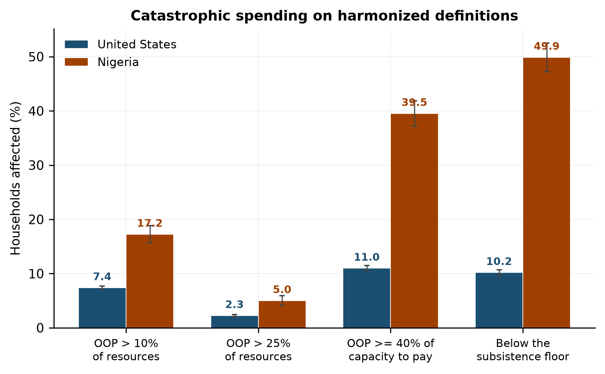
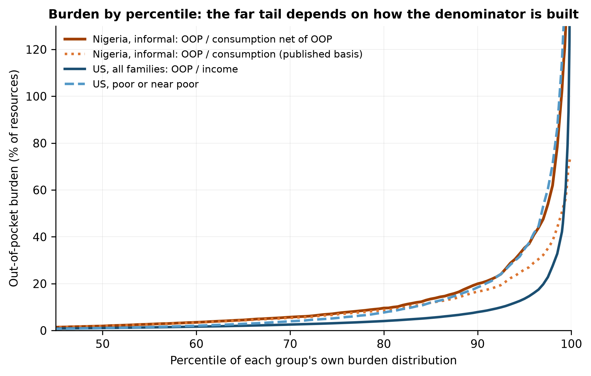
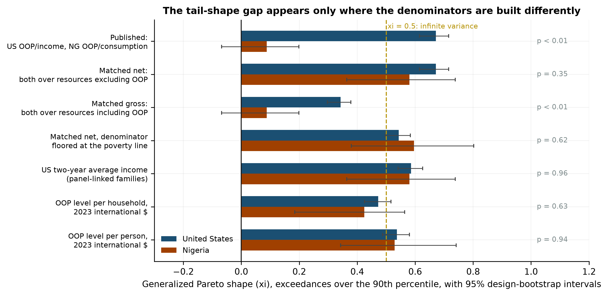
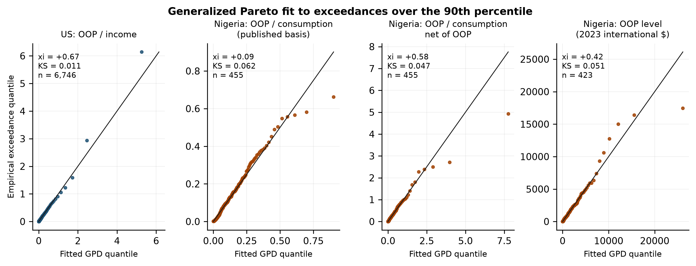
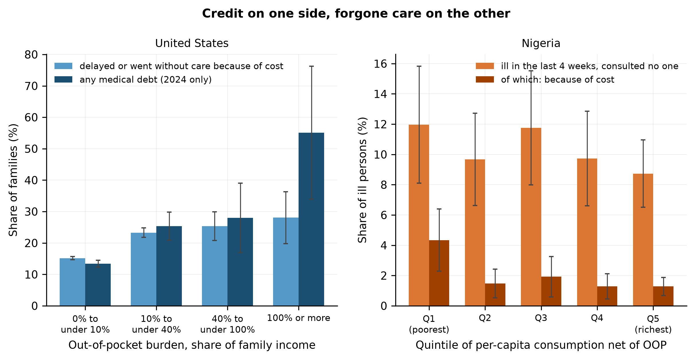

# Financial Protection against Health-Cost Shocks: A Harmonized US–Nigeria Comparison of Catastrophic Spending, Underinsurance, and Out-of-Pocket Tail Risk

**Oluwatosin Dorcas Babalola**¹ *(corresponding author)*, **Eniola Zainab Olamilekan**², **Adebolu Temitope**³

¹ Department of Actuarial Science and Quantitative Risk Analysis and Management, Georgia State University, Atlanta, GA, USA. obabalola4@student.gsu.edu

² Department of Actuarial Science, University of Lagos, Lagos, Nigeria.

³ Federal University of Technology, Akure, Nigeria.

**Word count.** 5,557 excluding abstract, tables and references.

---

## Abstract

**Background.** Catastrophic-spending rates count households crossing a threshold and say nothing about the size of the worst losses. Actuarial tail measures can describe those losses, but a ratio's upper tail depends on how its denominator is built, and survey denominators differ between countries.

**Methods.** We compared out-of-pocket burden in the Medical Expenditure Panel Survey (2019–2024, 63,799 family-years) and the Nigeria General Household Survey-Panel (2023/24, 4,685 households) on identical catastrophic-spending definitions, then applied expected shortfall and generalized Pareto tail estimation with a weighted likelihood and design-based bootstrap intervals. Because US resources are income and Nigerian resources are a consumption aggregate that contains the out-of-pocket spending, every tail comparison was repeated on matched denominators, on two-year income for panel-linked US families, and on spending levels in international dollars.

**Results.** Nigerian households exceed a 10% budget share 2.3 times as often as US families (17.2% against 7.4%) and carry a heavier burden at every quantile. On the published denominators the US tail index is 0.67 and the Nigerian 0.09, but the gap is an artifact of the bounded Nigerian ratio: on matched constructions the indices are 0.67 and 0.58 (p = 0.35), and 0.47 and 0.42 for spending levels. Both distributions are heavy-tailed. Poverty raises the 95th percentile of burden by 25 points in the United States and 11 in Nigeria.

**Conclusions.** Nigeria has the heavier burden throughout its distribution. Cross-country tail comparisons require denominators built the same way; the SDG consumption basis cannot support them.

**Keywords.** financial protection; out-of-pocket spending; tail risk; expected shortfall; extreme value theory; MEPS; Nigeria

---

## 1. Introduction

Catastrophic health expenditure is the standard summary of financial protection. It is the share of households whose out-of-pocket health spending exceeds a fixed fraction of their resources, and it is reported for most countries under Sustainable Development Goal indicator 3.8.2 (Wagstaff et al. 2018; WHO and World Bank 2023). The indicator is an incidence measure. It records how many households cross a line and nothing about how far past the line they go, which is the quantity that decides whether a household recovers or is ruined.

Actuaries summarize the far end of a loss distribution with a different set of tools: a high quantile (Value-at-Risk), the mean loss beyond it (expected shortfall, or Conditional Value-at-Risk), and the shape parameter of a generalized Pareto distribution fitted to exceedances over a high threshold, which measures how heavy the tail is (Davison and Smith 1990; Artzner et al. 1999; Klugman, Panjer and Willmot 2019). These measures are rarely applied to household health spending and, as far as we can find, have not been used to compare a high-income and a low-income health system on a common basis.

This paper does that for the United States and Nigeria. The two systems are near opposites. Nigeria finances 72% of health spending out of household pockets and insures 2% of households in the survey used here; the United States finances 11% out of pocket, spends over $13,000 per person a year, and insures nine families in ten for the full year (World Bank n.d.). We asked three questions. How do the two countries compare on the conventional catastrophic-spending measures? How do they compare on tail measures? And do the answers survive the differences between the two surveys?

The third question turned out to decide the second. Family income in the US survey does not contain the out-of-pocket spending that is divided into it, so the ratio can exceed one and its upper tail is unbounded. The Nigerian consumption aggregate, built to the SDG convention, contains that spending, so the ratio is bounded below one by construction and a generalized Pareto fit to it must find a light tail. On the published denominators the American tail index is 0.67 and the Nigerian 0.09, a contrast that an earlier draft of this paper reported as its main result. On any construction that treats the two countries alike, the two indices are within sampling error of each other and both are heavy. We report the artifact, its correction, and what remains once it is removed.

Three findings remain. Nigeria has the heavier burden at every point of the distribution, including the far tail, and by a wider margin than the headcount suggests. Both countries' out-of-pocket distributions have tail indices near 0.5, so the variance of household health-cost burden is infinite or close to it in both, whatever the coverage system. And poverty is the strongest predictor of an extreme burden in both countries once poverty is measured on resources net of health spending; the appearance that it protects Nigerian households, which the earlier draft also reported, comes from ranking households on a consumption aggregate that rises when they spend on health.

## 2. Background

### 2.1 Measuring financial protection

The measurement tradition runs from Xu et al. (2003), who defined catastrophic spending as out-of-pocket payments at or above 40% of capacity to pay, through Wagstaff and van Doorslaer (2003), who added measures of intensity and concentration, to the SDG budget-share indicator at 10% and 25% of consumption (Wagstaff et al. 2018). Rahman, Gasbarro and Alam (2022) reviewed 155 studies of financial risk protection in low- and middle-income countries and found that most measured incidence alone (37%) or incidence with impoverishment (39%). Cylus, Thomson and Evetovits (2018) showed on 14 European budget surveys that the budget-share method concentrates catastrophic spending among richer households while capacity-to-pay methods concentrate it among the poor, so the choice of denominator changes who is counted. That finding concerns the middle of the distribution; the present paper shows the same choice governs the tail.

### 2.2 The United States

The American literature documents high out-of-pocket burden without treating it as a tail problem. Baird (2016a) estimated the probability that out-of-pocket spending exceeds 5% or 10% of income and found that in 2013 over a quarter of non-elderly low-income adults in poor health spent 10% or more. Baird (2016b) compared the United States with Canada on harmonized 2010 data and found the risk of large medical expenses 1.5 to 4 times higher in the United States, with the gap widest for poorer citizens. Bernard, Selden and Fang (2023) examined the joint distribution of high out-of-pocket burden, medical debt and cost-related barriers to care in the 2018–19 MEPS and found 27% of non-elderly adults in families with at least one of the three; the three are distinct problems that need not coincide, which matters here because debt and forgone care are the two ways a household can escape a high measured burden. Fahle, McGarry and Skinner (2016) documented the concentration of out-of-pocket spending among Americans aged 55 and over, with the top 10% of spenders accounting for 42% of spending, and Caraballo et al. (2020) and Richard, Walker and Alexandre (2018) reported financial hardship from medical bills among adults with diabetes and with chronic conditions. The Commonwealth Fund's underinsurance definition, which flags insured adults whose out-of-pocket spending or deductible is large relative to income (Schoen et al. 2008), is adapted below as an outcome.

### 2.3 Tail estimation on survey data

The generalized Pareto distribution is the limiting distribution of exceedances over a high threshold (Balkema and de Haan 1974; Pickands 1975), and its shape parameter xi is the object of interest: xi > 0 gives a power-law tail, xi ≥ 0.5 an infinite variance, and xi < 0 a tail with a finite endpoint (Coles 2001). Expected shortfall is the coherent risk measure that a quantile is not (Artzner et al. 1999; Acerbi and Tasche 2002). Applying these to a stratified cluster sample needs a weighted likelihood and a resampling scheme that respects the design (Rao and Wu 1988; Lumley 2004); Section 4 sets both out.

## 3. Data

**United States.** The MEPS Household Component Full-Year Consolidated files for 2019 through 2024, pooled with the HC-036 linkage file, which supplies strata and primary sampling units (PSUs) common to all years. Persons were aggregated to the annual family (the unit that pays a bill), giving 145,143 person-years in 69,946 family-years. MEPS assigns a zero family weight to units out of scope for part of the year; the 6,147 such family-years were dropped, leaving 63,799 family-years weighted to 141.9 million families and 323.8 million persons a year. Dollar amounts were deflated to 2024 with the World Bank consumer price index for the United States.

Out-of-pocket spending is `TOTSLF`, the sum over all medical events of amounts paid by the person or family, including prescription drugs and excluding insurance premiums. Resources are annual family income, which MEPS builds from the Current Population Survey income questions and which can be zero or negative. Burden is undefined for the 3.7% of family-years with income below $1,000; these are excluded from every rate rather than coded as non-catastrophic, and the exclusion is varied in Section 5.8. Because MEPS panels overlap across annual files, 80% of persons can be linked to their family income in the adjacent year, which gives a two-year average income for 51,635 family-years (84%). Round 4/2 of each year asks whether anyone delayed or went without medical care or prescription medicines because of cost, and the 2024 file asks about medical debt.

**Nigeria.** The output of the companion paper's pipeline on wave 5 of the General Household Survey-Panel (2023/24): 4,685 households with the full survey design. Out-of-pocket spending comes from the individual health module: consultation fees, prescription and non-prescription drugs for outpatient episodes in the last four weeks, annualized by 13, plus hospital stays in the last 12 months. Transport is excluded, as are premiums, so the numerator matches the American one in scope. The consumption aggregate is food, non-food items other than health, education, and the same out-of-pocket spending, so that health spending enters the denominator once and from the same instrument. Naira are in constant August 2023 prices. Two percent of households report health insurance and 81% have no formal-sector worker. For the care-seeking analysis the post-planting health section was read directly: for each member ill or injured in the last four weeks it records whether anyone was consulted and, if not, why.

**Validation.** The US build reconstructs the poverty threshold from family income and the published income-to-poverty ratio. The derived medians for families of one to four, $16,319, $21,004, $25,248 and $31,812, match the 2024 Census Bureau thresholds for the modal family composition of each size ($16,320, $21,006, $25,249, $31,812) to within a dollar (Table A11), which checks the deflation and the income variable at once.

## 4. Methods

### 4.1 Harmonization

Catastrophic spending is measured identically in both countries: a budget share above 10%, 25% or 40% of resources, and out-of-pocket spending at or above 40% of capacity to pay, where capacity to pay is resources net of the national poverty threshold for the household's size. Xu et al. (2003) derive the subsistence floor from food shares, which MEPS cannot support, so the poverty threshold is the harmonized floor and Nigeria's food-share floor is kept as a check. Half of Nigerian households sit at or below the poverty line and have no capacity to pay; a household in that position that spends anything on health is counted as catastrophic, since dropping such households would drop the poorest half of the country. The share with no capacity is reported alongside.

Underinsurance follows Schoen et al. (2008): insured all year, and out-of-pocket spending at or above 10% of income, or 5% for families under twice the poverty line. The deductible criterion cannot be applied in MEPS, so the rate is a lower bound. Because the definition is itself a burden measure, it is reported as an outcome and never used to group families.

Comparison groups are insurance status, poverty category, chronic condition and an elderly member in the United States; sector, consumption quintile, insurance and residence in Nigeria. For the regressions, age cut-offs are those the Nigerian file carries (a member aged 60 or over, a child under five) applied to both countries.

### 4.2 The denominator

Resources are family income in the United States and household consumption in Nigeria. No transformation makes these the same variable, and the paper compares relative burden, not welfare. The difference that matters for tail estimation is mechanical rather than conceptual. Nigerian consumption contains the out-of-pocket spending it is divided into, so the ratio OOP / consumption is below one by construction and its exceedances must have a bounded distribution. US income does not contain the spending, so OOP / income is unbounded and takes values above one whenever a bill was met from savings, credit or a relative's help. A generalized Pareto fit to the first ratio will tend to a negative shape at high thresholds however heavy the underlying spending tail; a fit to the second will not. In addition, income is measured for one year and can be low for transitory reasons, and a ratio with a small denominator is heavy-tailed whatever its numerator.

We therefore estimated every tail comparison on several constructions and treated a conclusion as established only when it held on all of them:

- *Published.* US OOP / income; Nigeria OOP / consumption (the SDG basis).
- *Matched net.* Both over resources excluding health spending: US OOP / income; Nigeria OOP / (consumption minus OOP).
- *Matched gross.* Both over resources including it: US OOP / (income plus OOP); Nigeria OOP / consumption.
- *Floored.* Matched net with the denominator floored at the poverty threshold in both countries, which removes small-denominator effects.
- *Two-year income.* US OOP over the average of the family's income in the survey year and the adjacent year, for panel-linked families, against the matched net Nigerian ratio. Two-year income approximates permanent income; family income in adjacent years has a log correlation of 0.75 (Table 4).
- *Levels.* Out-of-pocket spending itself, per household and per person, in 2023 international dollars at the World Bank private-consumption purchasing-power parity, which involves no denominator.

Neither matched ratio is exact: income exceeds consumption for savers and falls short of it for borrowers. That is why the levels comparison, which has no denominator, is included.

### 4.3 Tail measures and inference

Value-at-Risk at level q is the weighted q-th quantile of the burden distribution; expected shortfall (CVaR) is the weighted mean of burdens at or above it. For the tail shape we fitted a generalized Pareto distribution to exceedances over the weighted 90th percentile, with location fixed at zero and shape xi and scale sigma estimated by maximizing the survey-weighted log-likelihood, which is the pseudo-likelihood that makes the estimate refer to the population rather than the sample. Fits were repeated at the 80th, 85th, 95th and 97.5th percentiles, and goodness of fit was checked by quantile-quantile plots of the exceedances against the fitted distribution and by the largest gap between the weighted empirical and fitted distribution functions (reported descriptively, since it has no standard reference distribution on a weighted clustered sample).

Confidence intervals come from a design bootstrap. In each stratum n_h − 1 PSUs are drawn with replacement and the weights rescaled by n_h / (n_h − 1) times the number of draws (Rao and Wu 1988); the unscaled scheme that draws n_h PSUs understates the variance by (n_h − 1) / n_h, which is half for the 35 MEPS strata that contain two PSUs. Every statistic, including the threshold and the shape, is recomputed on each of 400 replicates and percentile intervals are taken. The two samples are independent, so the interval for a US–Nigeria difference is taken from differences of independently drawn replicates and a Wald test uses the two bootstrap standard errors.

### 4.4 Drivers, parity and mechanism

Unconditional quantile regressions (Firpo, Fortin and Lemieux 2009) of burden on matched household characteristics were estimated at the 50th, 75th, 90th and 95th percentiles, with standard errors clustered on the stratum-PSU pair; MEPS numbers PSUs within strata, so clustering on the PSU label alone would pool 411 clusters into eight. Nigerian burden and poverty position are both measured on consumption net of out-of-pocket spending, for the reason given in Section 4.2: a household that spent heavily on health is otherwise ranked richer by its own spending. The gross ranking is reported as a variant.

Parity statistics locate where the American distribution reaches Nigerian levels: the share of US families whose burden exceeds the Nigerian informal household's median, upper quartile and 90th percentile, and the percentile above which a US group's burden exceeds the Nigerian burden at the same percentile, searched over the 5th to 99.9th percentiles with crossings at the edge of the grid flagged. Both are computed against Nigerian references on the SDG and the net basis.

The mechanism proposed for the shape of the two distributions, that Nigerian households forgo care they cannot pay for while American households are treated and then billed, is examined with the items each survey carries: cost-related delay or non-receipt of care and medical debt in MEPS, tabulated by burden band and income, and non-consultation among ill members and its stated reason in the GHS-Panel, tabulated by quintile of consumption net of health spending.

## 5. Results

### 5.1 Catastrophic spending

Table 1 and Figure 1 give the harmonized rates. At the 10% budget share, 17.2% of Nigerian households are affected (95% CI 15.7 to 18.8) against 7.4% of US families (7.1 to 7.7), a ratio of 2.3. At 25% the rates are 5.0% and 2.2%; at 40%, 1.6% and 1.1%. On capacity to pay the gap widens to 39.5% against 11.0%, but that figure depends on the floor: with Xu et al.'s food-share floor the Nigerian rate is 10.8%, and with a floor equivalized for household size it is 15.5% (Table 8). The share of households with no capacity to pay at all is 49.9% in Nigeria against 10.2% in the United States, and it is this share, counted as catastrophic whenever it spends anything, that the poverty-line rate mostly measures. Nothing below rests on the capacity-to-pay comparison.

**Figure 1.** Catastrophic spending on harmonized definitions. Bars are survey-weighted; whiskers are 95% design-based confidence intervals.

Within the United States the 10% rate rises from 3.1% of high-income families to 18.2% of poor families, and barely differs by insurance status (7.5% insured all year, 6.6% partly uninsured, 7.2% uninsured all year), a pattern returned to in Section 5.6. Within Nigeria it is flat across consumption quintiles, 13.9% in the poorest and 18.7% in the richest (Table A1). Underinsurance affects 10.3% of US families insured all year, and 26.4% of those below twice the poverty line (Table A2).

### 5.2 The distribution by quantile

Table 2 gives the burden at six quantiles on the published and the matched constructions. On the published basis the Nigerian burden is about twice the American one from the median (1.88% against 1.06%) to the 95th percentile (25.0% against 13.6%), and the two appear to converge at the 99th (48.2% against 42.1%). The convergence is where the construction bites. On the matched net basis the Nigerian 95th percentile is 33.3% and the 99th is 93.0%, more than twice the American 42.1%; on the matched gross basis the American 99th percentile falls to 29.6% against the unchanged Nigerian 48.2%. Figure 2 shows the full curves. Under either matched construction Nigeria's burden is the heavier at every percentile from the median up.

**Figure 2.** Out-of-pocket burden by percentile of each group's own distribution. The Nigerian informal curve is drawn on consumption net of out-of-pocket spending and, dotted, on the published SDG basis. The two US curves are on family income.

### 5.3 Tail shape and the denominator tests

Table 3 gives the tail measures by group on the matched net basis, Table 4 the US–Nigeria comparison under each construction, and Figure 3 the shape estimates.

On the published denominators the generalized Pareto shape is +0.672 (95% CI 0.615 to 0.715) for all US families and +0.088 (−0.068 to 0.199) for all Nigerian households, a difference of 0.58 with p < 0.001. The Nigerian estimate turns negative at higher thresholds, −0.20 at the 97.5th percentile (Table A5), and its quantile-quantile plot bends below the diagonal in the upper tail (Figure 4), both of which are what a bounded variable produces. Every Nigerian group on this basis has a point estimate between −0.20 and +0.09 (Table A4).

On the matched net basis the Nigerian shape is +0.581 (0.364 to 0.738). The US–Nigeria difference is 0.09 (−0.08 to 0.31, p = 0.35). With the denominator floored at the poverty line the two estimates are +0.543 and +0.596 (p = 0.62); on two-year income for panel-linked US families they are +0.586 and +0.581 (p = 0.96); for spending levels in international dollars they are +0.472 and +0.424 per household (p = 0.63) and +0.537 and +0.529 per person (p = 0.94). The one matched construction that still separates the countries is the gross one, +0.343 against +0.088 (p < 0.001), and it is the construction that bounds both ratios below one, on which the US estimate also falls toward zero at high thresholds (+0.08 at the 97.5th percentile; Table A12). The fit is close on every unbounded construction (Figure 4, Table A6): the largest gap between empirical and fitted distribution functions is 0.011 for the US ratio, 0.047 for the Nigerian net ratio and 0.051 for Nigerian spending levels, against 0.062 for the bounded Nigerian ratio. US estimates move between 0.63 and 0.67 across thresholds and Nigerian net estimates between 0.46 and 0.58.

**Figure 3.** Generalized Pareto shape above the 90th percentile in both countries under each construction of the denominator, with 95% Rao-Wu bootstrap intervals and the p-value of the US minus Nigeria difference.

**Figure 4.** Quantile-quantile plots of the exceedances against the fitted generalized Pareto distribution. The bounded Nigerian ratio (second panel) falls below the diagonal through its upper tail; on the unbounded constructions departures are confined to the last few points.

Two conclusions follow. First, the claim that the American burden distribution is heavy-tailed while the Nigerian one is bounded is not supported; it is a property of the SDG denominator. Second, both distributions are heavy-tailed, with shape estimates near or above 0.5, so the variance of the burden is infinite or nearly so in both countries and the mean of the worst cases is dominated by a few very large bills.

Expected shortfall reads the same way. At the 95th percentile the mean burden is 42.9% of income in the United States (38.2 to 47.5). On the SDG basis the Nigerian figure is 38.1% (34.6 to 41.6), which is the comparison the earlier draft made; on the net basis it is 76.2% (61.3 to 93.9), and on the gross basis, where the American figure becomes 23.4%, Nigeria's 38.1% is again the larger. Nigeria's expected shortfall exceeds the American one on both matched constructions and with the poverty-line floor (59.4% against 30.5%).

### 5.4 The American tail on its own terms

Within the United States the tail is concentrated among the poor. Poor and near-poor families have a 95th-percentile burden of 34.8% of income and an expected shortfall beyond it of 124.7% (96.3 to 160.4), against 13.6% and 42.9% for all families (Table 3). At the 99th percentile the group's expected shortfall is 391% of income. Part of this is transitory income: on two-year average income the expected shortfall of poor and near-poor panel-linked families falls from 103.8% to 61.5% and the share of all families whose spending exceeds a year's income falls from 0.23% to 0.19% (Table 4). The shape estimate for the group is unchanged by the two-year measure (+0.609 against +0.615). A burden above a year's income remains a real event in the American data and an impossible one on the Nigerian SDG basis.

By insurance status the shape estimates are +0.659 for families insured all year, +0.737 for the partly uninsured and +0.594 for the uninsured all year, with overlapping intervals. Families insured all year have a higher median burden (1.13%) than families uninsured all year (0.28%) and the same 95th percentile (13.6% against 14.4%; Table A3). Coverage compresses the middle of the distribution and leaves the tail where it is.

### 5.5 What moves the upper tail

Table 6 reports the unconditional quantile regressions. In the United States, being below the poverty line shifts the median burden by 0.09 percentage points and the 95th percentile by 25.22 points (t = 21.0); in Nigeria the same variable shifts the 95th percentile by 10.68 points (t = 3.6). Poverty is the strongest household-level predictor of an extreme burden in the United States and a strong one in Nigeria. The earlier draft reported a Nigerian coefficient of −8.17 at the 95th percentile and read it as poverty censoring the burden; that sign comes from ranking households on gross consumption, which rises with the outcome (Table A10).

Chronic illness raises the Nigerian 95th percentile by 32.5 points and the American by 3.8, the difference between a system that pays for recurring care and one that does not. A member aged 60 or over adds 6.5 points in the United States and 6.7 in Nigeria. Larger households have lower upper quantiles in both, which is the arithmetic of a per-household denominator. Being uninsured for part of the year lowers the US median by 0.47 points and has no significant effect at the 95th percentile in either country once income is controlled for.

### 5.6 Credit and forgone care

Table 5 and Figure 5 give the direct evidence on mechanism. In the United States, 15.8% of families report that a member delayed or went without care or medicines because of cost; the share is 20.9% below the poverty line and 11.2% above four times it, and it rises with burden from 15.2% of families under a 10% burden to 28.1% of those whose spending exceeded a year's income. Medical debt, asked in 2024, is carried by 14.5% of families overall, 25.3% of those with a burden between 10% and 40%, and 55.1% (34 to 76) of the 29 sampled families whose spending exceeded a year's income. The bills that put a family beyond its annual income are financed, and the survey records them.

In Nigeria, 10.2% of persons ill in the last four weeks consulted no one, and 1.9% consulted no one because of cost; the cost-related share is 4.3% in the poorest fifth of households (ranked on consumption net of health spending) and 1.3% in the richest. Among households with an ill member, 12.4% spent nothing, with no gradient across quintiles. Cost-related forgone care is concentrated among the poor, as the censoring argument requires, but it is small relative to the 17% of households above the catastrophic line, and most of the poorest households that fell ill did spend. The mechanism operates at the margin in Nigeria; it does not explain the shape of the distribution, which on a matched basis is as heavy as the American one.

**Figure 5.** Left: US families reporting a cost-related delay or non-receipt of care, and any medical debt (2024), by out-of-pocket burden. Right: Nigerians ill in the last four weeks who consulted no one, and who gave cost as the reason, by quintile of household consumption net of health spending. Whiskers are 95% confidence intervals.

### 5.7 Parity

Table 7 gives the parity statistics. The median Nigerian informal household spends 1.87% of consumption out of pocket (1.91% net of health spending), and 37.0% of US families carry a heavier burden than that; among families with an elderly member the share is 50.4%, and among poor and near-poor families 41.2%. Against the Nigerian informal upper quartile (6.9%), 11.6% of US families and 21.4% of poor and near-poor families are above; against the 90th percentile (16.6% on the SDG basis, 19.9% net), 3.8% and 11.1% on the SDG basis and 3.0% and 9.1% net. These figures barely move with the construction because they refer to the middle of the Nigerian distribution.

The crossover statistic does move. On the SDG basis poor and near-poor US families overtake the Nigerian informal sector at the 85th percentile of their own distribution and all US families at the 99.3rd; on the net basis the poor and near-poor cross at the 95.5th, families with an elderly member only at the last grid point, and no other group at all (Table A7). The earlier draft's statement that American families as a whole reach Nigerian burden levels in the far tail depends on the bounded Nigerian denominator.

### 5.8 Robustness

Table 8 reruns the comparison under sixteen variants: dropping the pandemic year, single MEPS years, income floors from $500 to $5,000, restricting US families to incomes at or above the poverty line, the food-share floor, equivalization, two alternative tail thresholds, Nigerian out-of-pocket spending with transport and from the consumption module, and the two matched constructions. Nigeria's 10% budget-share rate exceeds the American one in 15 of 16 variants (Table A9); the exception is the consumption-module instrument, a single annual-recall question that finds spending in a sixth of households and gives a rate of 0.1%, which is why the health module is the primary source. The American shape point estimate exceeds the Nigerian one in all 16, but in the matched net variant the Nigerian estimate is 0.58 and the difference is not significant; the matched gross variant separates the countries only because both ratios are bounded there (Table 4). American expected shortfall exceeds Nigerian in 11 of 16; the five exceptions are the two matched constructions, the two higher income floors and the poverty-line restriction, which are the variants that either treat the denominators alike or remove low US incomes. Across the three subsistence floors the Nigerian capacity-to-pay rate ranges from 10.8% to 39.5% while the American rate stays between 8.6% and 11.0%.

The absolute comparison (Table A8) is unaffected by any of this: mean out-of-pocket spending is $1,194 per person a year in the United States and $142 in Nigeria in 2023 international dollars, a ratio of 8.4, against mean resources per person of $48,309 and $2,279, a ratio of 21.2.

## 6. Discussion

**What the comparison shows.** Nigerian households face a heavier out-of-pocket burden than American families at every point of the distribution. The catastrophic-spending headcount understates the gap in the tail rather than overstating it: at the 95th percentile the Nigerian burden is 1.8 times the American on the SDG basis and 2.5 times on the net basis, and the mean burden of the worst-affected 5% is higher in Nigeria on every construction that treats the two denominators alike. Both distributions are heavy-tailed with shape estimates near 0.5, in the ratio and in spending levels alike, and the difference between them in tail shape is within sampling error. Poverty raises the extreme quantiles of burden in both countries.

**What it corrects.** The earlier draft of this paper reported a heavy American tail and a bounded Nigerian one, a Nigerian expected shortfall below the American, convergence of the two distributions at the 99th percentile, and a negative effect of poverty on the Nigerian upper tail, and offered a mechanism (credit on one side, forgone care on the other) for the contrast. Each of those results came from dividing Nigerian spending by an aggregate that contains it, or from ranking households on that aggregate. The mechanism is real in a weaker form. Medical debt does rise steeply with burden in the United States and cost-related forgone care is three times as common among the poorest Nigerian fifth as the richest, but forgone care is too small in the Nigerian data to bound the distribution, and once the denominator is matched there is no bounded distribution to explain.

**Implications for measurement.** The SDG budget-share indicator divides out-of-pocket spending by consumption inclusive of that spending. For an incidence measure at 10% or 25% this is a convention with modest consequences; Table 2 shows the Nigerian 90th percentile moving from 16.3% to 19.5% between the two bases. For any tail measure it is decisive, because a ratio bounded at one cannot have a heavy tail whatever the underlying spending does. Comparisons of tail risk across surveys with different resource concepts, and comparisons within a country between income-based and consumption-based surveys, should be made on resources net of health spending or on spending levels, and should report both. The same applies to regression analyses that rank households by consumption: the poverty coefficient changed sign here when the ranking was moved to consumption net of health spending.

**Implications for policy.** For Nigeria the finding is the companion paper's, sharpened: the burden is high through the whole distribution, half of households have no capacity to pay, and the far tail, once measured on a basis that can see it, is as heavy as in a system where bills are routinely financed. For the United States the finding is narrower than the earlier draft's. American coverage holds the middle of the distribution far below Nigeria's; it does not truncate the tail, and among poor and near-poor families the mean burden of the worst-affected 5% exceeds a year's income on one-year income and 60% of it on two-year income. The families whose spending exceeded a year's income are those most likely to carry medical debt. A benefit design evaluated on average burden will look adequate for this group; the same design evaluated on expected shortfall will not.

**Limitations.** The denominators differ in concept and no construction makes them identical; the levels comparison avoids the problem at the cost of ignoring resources altogether. Income is more volatile than consumption, and the two-year measure reduces but does not remove the effect of transitory income on the American tail. The Nigerian tail estimates rest on 455 exceedances and their intervals are wide. Both surveys under-sample very large medical events and neither observes premiums, which understates the American burden. The medical-debt item is available for one year and the cost-barrier items are asked of one round. The Nigerian care-seeking items refer to a four-week window and record the stated reason for not consulting, not the care that a poorer household would have sought under a different price. The Nigerian data are one wave.

## 7. Conclusion

On identical catastrophic-spending definitions Nigerian households cross the 10% line 2.3 times as often as American families, and on any construction of the denominator that treats the two countries alike they carry the heavier burden at every quantile through the 99th. Both distributions of out-of-pocket burden are heavy-tailed, with generalized Pareto shape estimates near 0.5 that do not differ between the countries once the denominators are matched or the comparison is made on spending levels. The contrast between a heavy American tail and a bounded Nigerian one, which an earlier version of this analysis reported, is produced by the SDG convention of dividing health spending by a consumption aggregate that contains it. Tail comparisons of financial protection across surveys need denominators built the same way, and the tools to make them are the same microdata already collected for the SDG indicator.

---

## Declarations

**Data availability.** MEPS public-use files are freely available from the Agency for Healthcare Research and Quality without registration. The GHS-Panel microdata are available from the World Bank Microdata Library subject to registration. Neither is redistributed. All analysis code is at https://github.com/tosin-babs/us-nigeria-health-cost-tail-risk.

**Code availability.** Complete, seeded reproduction code in Python; see the repository README for the download steps and script order.

**Competing interests.** None declared.

**Ethics.** The analysis uses de-identified secondary survey data and did not require ethical approval.

---

## References

1. Acerbi, C., & Tasche, D. (2002). On the coherence of expected shortfall. *Journal of Banking and Finance*, 26(7), 1487–1503. doi:10.1016/S0378-4266(02)00283-2
2. Artzner, P., Delbaen, F., Eber, J.-M., & Heath, D. (1999). Coherent measures of risk. *Mathematical Finance*, 9(3), 203–228. doi:10.1111/1467-9965.00068
3. Baird, K. E. (2016a). Recent trends in the probability of high out-of-pocket medical expenses in the United States. *SAGE Open Medicine*, 4. doi:10.1177/2050312116660329
4. Baird, K. E. (2016b). The financial burden of out-of-pocket expenses in the United States and Canada: how different is the United States? *SAGE Open Medicine*, 4. doi:10.1177/2050312115623792
5. Balkema, A. A., & de Haan, L. (1974). Residual life time at great age. *Annals of Probability*, 2(5). doi:10.1214/aop/1176996548
6. Bernard, D. M., Selden, T. M., & Fang, Z. (2023). The joint distribution of high out-of-pocket burdens, medical debt, and financial barriers to needed care. *Health Affairs*, 42(11), 1517–1526. doi:10.1377/hlthaff.2023.00604
7. Caraballo, C., Valero-Elizondo, J., Khera, R., Mahajan, S., et al. (2020). Burden and consequences of financial hardship from medical bills among nonelderly adults with diabetes mellitus in the United States. *Circulation: Cardiovascular Quality and Outcomes*, 13(2), e006139. doi:10.1161/CIRCOUTCOMES.119.006139
8. Coles, S. (2001). *An Introduction to Statistical Modeling of Extreme Values*. London: Springer. doi:10.1007/978-1-4471-3675-0
9. Cylus, J., Thomson, S., & Evetovits, T. (2018). Catastrophic health spending in Europe: equity and policy implications of different calculation methods. *Bulletin of the World Health Organization*, 96(9), 599–609. doi:10.2471/BLT.18.209031
10. Davison, A. C., & Smith, R. L. (1990). Models for exceedances over high thresholds. *Journal of the Royal Statistical Society, Series B*, 52(3), 393–425. doi:10.1111/j.2517-6161.1990.tb01796.x
11. Fahle, S., McGarry, K., & Skinner, J. (2016). Out-of-pocket medical expenditures in the United States: evidence from the Health and Retirement Study. *Fiscal Studies*, 37(3–4), 785–819. doi:10.1111/j.1475-5890.2016.12126
12. Firpo, S., Fortin, N. M., & Lemieux, T. (2009). Unconditional quantile regressions. *Econometrica*, 77(3), 953–973. doi:10.3982/ECTA6822
13. Klugman, S. A., Panjer, H. H., & Willmot, G. E. (2019). *Loss Models: From Data to Decisions* (5th ed.). Hoboken, NJ: Wiley. ISBN 978-1-119-52378-9
14. Lumley, T. (2004). Analysis of complex survey samples. *Journal of Statistical Software*, 9(8). doi:10.18637/jss.v009.i08
15. Pickands, J. (1975). Statistical inference using extreme order statistics. *Annals of Statistics*, 3(1). doi:10.1214/aos/1176343003
16. Rahman, T., Gasbarro, D., & Alam, K. (2022). Financial risk protection from out-of-pocket health spending in low- and middle-income countries: a scoping review of the literature. *Health Research Policy and Systems*, 20, 83. doi:10.1186/s12961-022-00886-3
17. Rao, J. N. K., & Wu, C. F. J. (1988). Resampling inference with complex survey data. *Journal of the American Statistical Association*, 83(401), 231–241. doi:10.1080/01621459.1988.10478591
18. Richard, P., Walker, R., & Alexandre, P. K. (2018). The burden of out of pocket costs and medical debt faced by households with chronic health conditions in the United States. *PLOS ONE*, 13(6), e0199598. doi:10.1371/journal.pone.0199598
19. Schoen, C., Collins, S. R., Kriss, J. L., & Doty, M. M. (2008). How many are underinsured? Trends among U.S. adults, 2003 and 2007. *Health Affairs*, 27(Suppl 1), w298–w309. doi:10.1377/hlthaff.27.4.w298
20. Wagstaff, A., & van Doorslaer, E. (2003). Catastrophe and impoverishment in paying for health care: with applications to Vietnam 1993–1998. *Health Economics*, 12(11), 921–933. doi:10.1002/hec.776
21. Wagstaff, A., Flores, G., Hsu, J., Smitz, M.-F., et al. (2018). Progress on catastrophic health spending in 133 countries: a retrospective observational study. *The Lancet Global Health*, 6(2), e169–e179. doi:10.1016/S2214-109X(17)30429-1
22. WHO & World Bank (2023). *Tracking Universal Health Coverage: 2023 Global Monitoring Report*. Geneva: World Health Organization and Washington, DC: World Bank. doi:10.1596/40348
23. World Bank (n.d.). *World Development Indicators*: out-of-pocket expenditure as a share of current health expenditure (SH.XPD.OOPC.CH.ZS) and current health expenditure per capita (SH.XPD.CHEX.PC.CD), 2023 values. https://data.worldbank.org.
24. Xu, K., Evans, D. B., Kawabata, K., Zeramdini, R., Klavus, J., & Murray, C. J. L. (2003). Household catastrophic health expenditure: a multicountry analysis. *The Lancet*, 362(9378), 111–117. doi:10.1016/S0140-6736(03)13861-5
25. Babalola, O. D., Iroko, O. E., & Oyinlade, O. (n.d.). *Measuring the Health-Protection Gap and Actuarially Pricing Informal-Sector Health Insurance under Nigeria's NHIA Act 2022*. Working paper. (Companion paper; supplies the Nigerian analysis file.)
