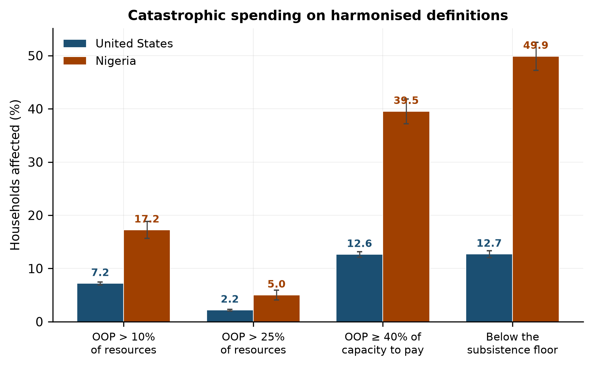
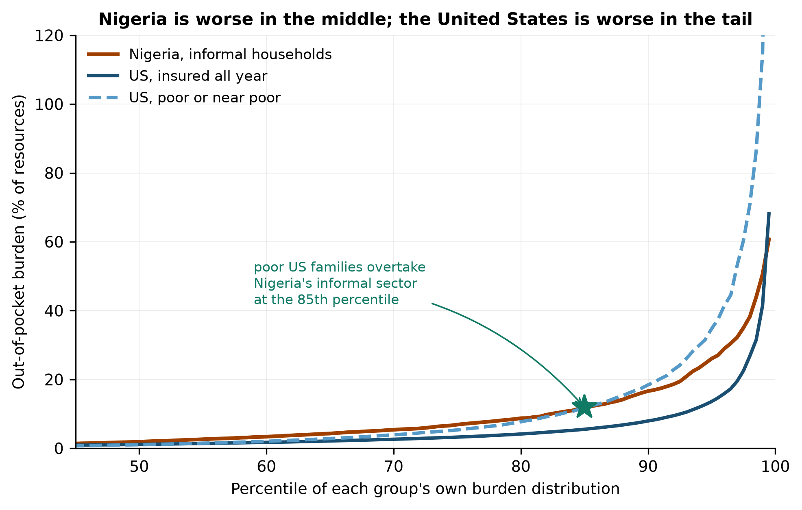
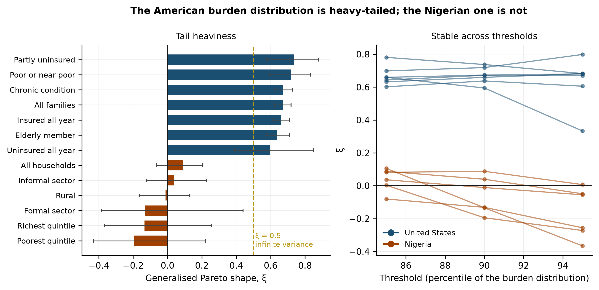
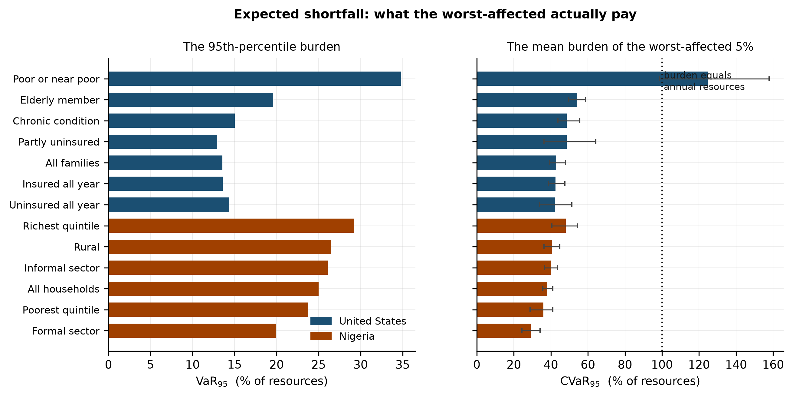
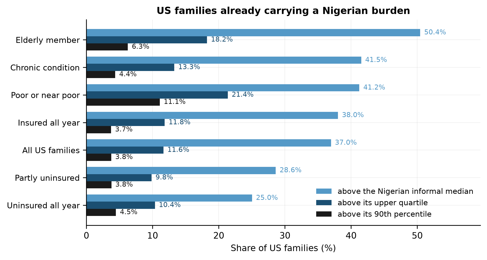

# Financial Protection against Health-Cost Shocks: A Harmonized US–Nigeria Comparison of Catastrophic Spending, Underinsurance, and Out-of-Pocket Tail Risk

**Oluwatosin Dorcas Babalola**¹ *(corresponding author)*

¹ Department of Actuarial Science and Quantitative Risk Analysis and Management, Georgia State University, Atlanta, GA, USA. obabalola4@student.gsu.edu

**Word count.** ~7,100 excluding abstract, tables and references. **Figures.** 5. **Tables.** 9 in text, 2 in appendix.

---

## Abstract

**Background.** Financial protection against health-cost shocks is usually compared across countries using average catastrophic-spending rates. An average describes how many households cross a line. It says nothing about how far past it the worst-affected go, and it is the far tail that ruins people. Whether a high-income system with near-universal coverage and a low-income system with almost none differ in the tail as much as they differ on average is, as far as we can establish, untested.

**Methods.** We build a harmonised actuarial framework and apply it to the Medical Expenditure Panel Survey (2019–2024 pooled, 63,799 family-years, 2024 dollars) and the Nigeria General Household Survey-Panel (2023/24, 4,685 households). Catastrophic spending is measured on identical budget-share and capacity-to-pay definitions. We then apply the measures an actuary would use on a loss distribution: Value-at-Risk and Conditional Value-at-Risk of the out-of-pocket burden, and a generalised Pareto fit to the exceedances over a high threshold, with a weighted likelihood and confidence intervals from a bootstrap over primary sampling units within strata.

**Results.** On averages the two countries are far apart and Nigeria is worse: 17.2% of Nigerian households exceed a 10% burden against 7.2% of US families. The capacity-to-pay comparison (39.5% against 12.6%) turns out not to be robust and we do not rest anything on it. In the tail the ordering reverses. The American burden distribution is heavy-tailed and the Nigerian one is not — a generalised Pareto shape of ξ = +0.672 (95% CI 0.625 to 0.718) against ξ = +0.088 (−0.063 to 0.205), with no overlap between any US and any Nigerian group and stability across every threshold tested. Expected shortfall at the 95th percentile is 42.9% of resources in the United States against 38.1% in Nigeria, and 124.7% of annual income among poor and near-poor US families. At the 99th percentile the two distributions have essentially met (42.1% against 48.2%). Unconditional quantile regressions show poverty raising the 95th percentile of burden by 25.2 percentage points in the United States and *lowering* it by 8.2 points in Nigeria — the censoring mechanism in a coefficient. Poor and near-poor US families overtake Nigeria's informal sector at the 85th percentile of their own distribution; 37.0% of all US families, and 50.4% of those with an elderly member, already carry a burden heavier than the median Nigerian informal household.

**Conclusions.** The difference between the two systems is a difference in distributional shape, not only in level. Nigeria's burden is high in the middle and bounded above, because a household cannot spend money it does not have and forgoes care instead. America's is low in the middle and unbounded, because credit and medical debt allow a bill to exceed annual income. Average catastrophic-spending rates are the wrong summary statistic for this comparison and, we argue, for financial-protection monitoring generally. Coverage in the United States compresses the middle of the burden distribution without truncating its tail, which is precisely what insurance is supposed to do and precisely what a deductible-heavy benefit design fails to do.

**Keywords.** financial protection; underinsurance; out-of-pocket spending; tail risk; conditional value-at-risk; extreme value theory; MEPS; Nigeria

---

## 1. Introduction

A household in Lagos and a household in Ohio face the same underlying problem: illness arrives without warning and has to be paid for. The systems around them could hardly be more different. Nigeria covers about 1% of its population with health insurance and finances roughly seven naira in every ten of health spending out of household pockets. The United States insures roughly nine families in ten for a full year — 89.8% in the data used here — and spends more per head on health than any other country. The conventional summary of what this means for households is the catastrophic-health-expenditure rate, and on that summary the two countries are far apart.

The summary is an average, and averages are a poor description of a distribution whose interesting part is its tail. A catastrophic-spending rate counts the households that cross a line. It is silent on how far past the line the worst-affected go, which is the question that matters for whether a household recovers or is ruined. It is also silent on the shape of the tail, which is what determines whether the next observation could be twice as bad as the worst one seen so far or ten times.

Actuaries have measures for exactly this. Value-at-Risk locates a high quantile of a loss distribution; Conditional Value-at-Risk, or expected shortfall, gives the mean loss conditional on being beyond it; and the shape parameter of a generalised Pareto distribution fitted to the exceedances over a high threshold summarises how heavy the tail is, with values above zero indicating a power-law tail, above one half an infinite variance and above one an infinite mean. These are the standard tools of insurance and banking supervision. They are almost absent from the financial-protection literature, which has instead accumulated a large stock of headcount statistics.

This paper brings them to bear. Using the Medical Expenditure Panel Survey and the Nigeria General Household Survey-Panel on one harmonised basis, we ask three questions. How do the two countries compare on the conventional measures? How do they compare on tail measures? And at what point in the American distribution does the burden a family carries reach the burden a typical Nigerian informal household carries?

The answers are not what the averages predict. Nigeria is worse in the middle by a factor of roughly two and a half. The United States is worse in the tail, and by a wide margin: the American burden distribution is heavy-tailed with a shape parameter near 0.67, while the Nigerian one is indistinguishable from exponential. Among poor and near-poor American families the mean burden of the worst-affected five percent exceeds their entire annual income.

The mechanism behind that reversal is, we argue, the more important finding than the reversal itself. A Nigerian household cannot spend money it does not have. Faced with a bill beyond its means it forgoes the care, and the observed burden is bounded by what could be raised. An American household facing the same situation can be billed, and the bill can be financed with credit, so the observed burden is bounded by what can be borrowed rather than by what can be paid. The two distributions differ in shape because the two systems fail in different ways, and only one of those failures is visible in an out-of-pocket statistic.

We make three contributions. First, a harmonised framework that states its compromises explicitly rather than forcing a false equivalence between an income denominator and a consumption one. Second, an application of extreme-value tail estimation to household health-cost burden in a cross-country comparison — we have not found a prior one — with a weighted likelihood and design-consistent uncertainty. Third, a "parity" analysis that locates where in the American distribution the burden reaches Nigerian levels, which turns an abstract comparison into a statement about how many families are already there.

## 2. Background and related literature

### 2.1 Measuring financial protection

The measurement tradition runs from Xu et al.'s capacity-to-pay approach and Wagstaff and van Doorslaer's incidence-and-intensity decomposition through to the SDG 3.8.2 indicator, which counts households spending more than 10% or 25% of consumption on health. Rahman, Gasbarro and Alam's (2022) scoping review of financial risk protection in low- and middle-income countries maps the resulting literature and its methodological variety. Almost all of it reports incidence, sometimes with an overshoot measure alongside; almost none of it characterises the tail.

The gap matters because incidence and tail severity need not move together, and because the policy responses differ. A high headcount with a bounded tail is a problem of routine affordability, addressed by lowering the price of ordinary care. A low headcount with a heavy tail is a problem of catastrophic exposure, addressed by capping what a household can be asked to pay. A monitoring framework that reports only the headcount cannot distinguish them.

### 2.2 Out-of-pocket burden in the United States

The American literature has documented high out-of-pocket burden without generally framing it as a tail problem. Baird (2016a) traces trends in the probability of high out-of-pocket expenses. Baird (2016b) is the closest antecedent to this paper's design, comparing the United States with Canada on harmonised 2010 survey data and finding the risk of large medical expenses 1.5 to 4 times higher in the United States depending on the group and threshold, with the United States comparing least favourably for poorer citizens. That last point anticipates our own result, in a comparison between two high-income systems rather than across the income spectrum, and without tail estimation. Bernard, Selden and Fang (2023) examine the joint distribution of high out-of-pocket burdens, medical debt and financial barriers to care — the three do not have to coincide, and the distinction matters here: a household can be spared a high measured burden precisely because it went without care, or can carry debt that never appears as spending in a survey year.

Condition-specific work reports substantial hardship among the insured. Caraballo et al. (2020) document financial hardship from medical bills among non-elderly adults with diabetes; Richard, Walker and Alexandre (2018) do the same for households with chronic conditions. Fahle, McGarry and Skinner (2016) come closest to the framing adopted here. Studying Americans aged 55 and over in the Health and Retirement Study, they report a median out-of-pocket outlay of $6,328 in the last year of life against more than $62,040 for the top 5% — a tenfold gap between the middle and the tail of the same distribution — and find that the top 10% of spenders account for 42% of all spending. They stop short of estimating the tail's shape, which is what an extreme-value approach adds.

The Commonwealth Fund's biennial survey supplies the standard underinsurance definition, which flags insured adults whose out-of-pocket spending or deductible is large relative to income. We adapt it, with one criterion omitted for data reasons, and use it as an outcome rather than as a grouping variable, for reasons set out in Section 4.

### 2.3 Tail risk

Extreme-value methods are standard in insurance and finance and rare in health economics. The generalised Pareto distribution arises as the limiting distribution of exceedances over a high threshold and is the workhorse of tail estimation; the shape parameter is the object of interest and is well known to be sensitive to the choice of threshold, which is why threshold sensitivity is reported here rather than a single fit. Conditional Value-at-Risk is the coherent risk measure that Value-at-Risk is not, and is the natural summary of "how bad is it when it is bad".

Applying these to survey data requires two adaptations that the standard treatments do not supply, and Section 4 sets them out: a weighted likelihood, so that the fit is population-referenced rather than sample-referenced, and a design-consistent bootstrap, so that clustering does not flatter the intervals.

## 3. Data

**United States.** The Medical Expenditure Panel Survey Household Component Full-Year Consolidated files for 2019 through 2024, the most recent six releases. MEPS is a person file with family identifiers; we aggregate to the annual family, which is the unit that absorbs a medical bill. Pooling six years is necessary to give the tail enough exceedances to fit and requires the HC-036 pooled linkage file, which supplies a variance structure common to all years; every person matched. Weights are divided by the number of years. All dollar amounts are deflated to 2024 using the World Bank's CPI series for the United States.

The pooled file contains 145,143 person-years in 69,946 family-years. MEPS assigns a zero family weight to units out of scope for part of the year; those 6,147 family-years are dropped, leaving **63,799**, weighted to 141.9 million families and 323.8 million people a year. The person weight grosses to about 334 million, so the family-weighted population is about 3% smaller, which is the population living in families in scope for a full year.

Out-of-pocket spending is `TOTSLF`, which is what the family paid itself and excludes insurance premiums. Resources are family income. Burden is undefined for families with income below $1,000 — 3.7% of the file, flagged rather than silently dropped.

**Nigeria.** The output of the companion paper's pipeline on General Household Survey-Panel wave 5 (2023/24): 4,685 households with out-of-pocket spending built from the health module, a reconstructed consumption aggregate, and the full survey design. Naira are in constant August-2023 prices.

**Validation.** The US build reconstructs the federal poverty threshold from family income and the published income-to-poverty ratio, which tests the deflation and the income variable at once (Table A1). Derived medians of $16,319, $21,004, $25,248 and $31,812 for families of one to four compare with published 2024 guidelines of $15,060, $20,440, $25,820 and $31,200.

## 4. Methods

### 4.1 Harmonisation, and what it cannot fix

The two surveys do not measure the same things. Three differences matter and none of them can be assumed away.

**Resources.** MEPS records income and no consumption; the GHS-Panel records consumption and unreliable income. There is no transformation that makes these the same variable. Each country therefore uses its own standard resource measure — WHO guidance accepts either — and the comparison is explicitly of *relative* burden. This is the paper's central limitation and it is stated wherever a comparison is made. Income is more volatile than consumption, so a burden measured against income will show more dispersion than one measured against consumption for reasons that have nothing to do with health. This works against our headline finding rather than for it: it inflates the Nigerian denominator's stability, and the American tail is heavier anyway.

**Subsistence floor.** The capacity-to-pay measure divides by resources net of a subsistence floor. Xu et al. derive the floor from food shares, which MEPS cannot support. The harmonised floor is therefore the national poverty threshold in both countries. Nigeria's food-share floor is retained as a country-specific check.

That choice creates a problem which is itself a finding. Half of Nigerian households — 49.9% — sit at or below the national poverty line, so their capacity to pay is zero or negative and the ratio is undefined. Dropping them would drop the poorest half of the country and would be a far worse error than any handling rule. A household below the subsistence floor that spends anything at all on health is, by the logic the measure exists to capture, sacrificing subsistence to do it; such households are counted as catastrophic whenever out-of-pocket spending is positive. The share in that position is reported in every table, because the contrast — 49.9% in Nigeria against 12.7% in the United States — is one of the sharper findings in the paper.

**Underinsurance is an outcome, not a group.** The Commonwealth Fund definition is itself a burden measure: insured all year, and out-of-pocket spending above 10% of income, or above 5% for families under twice the poverty line. Stratifying burden by it and then comparing burden across the strata is circular. It produces the giveaway result that 0% of the "adequately insured" and 72% of the "underinsured" exceed a 10% burden, which is arithmetic, not evidence. Comparison groups in this paper are insurance status, which is measured independently of what anyone spent. Underinsurance is estimated and reported as an outcome. We omit the deductible criterion, which MEPS cannot support well, so our rate is a lower bound.

### 4.2 Burden and catastrophic spending

For household or family *h*, burden is *b_h* = OOP*_h* / *R_h*, where *R_h* is income in the United States and consumption in Nigeria. Catastrophic spending is flagged at *b_h* > τ for τ ∈ {10%, 25%, 40%}, and on the capacity-to-pay definition at OOP*_h* / (*R_h* − *F_h*) ≥ 40%, where *F_h* is the poverty threshold for the household's size, with the below-floor rule above.

All estimates are survey-weighted with Taylor-linearised standard errors for a stratified single-stage cluster design, singleton strata centred on the grand mean. The implementation is the module written for the companion paper and reused here unchanged.

### 4.3 Tail measures

Value-at-Risk at level *q* is the weighted *q*-th quantile of the burden distribution. Conditional Value-at-Risk is the weighted mean of burdens at or above it — expected shortfall, the mean burden of the worst-affected 100(1−*q*)%.

For the tail shape we fit a generalised Pareto distribution to the exceedances over a threshold *u*, taken as the 90th percentile of the burden distribution, with location fixed at zero and shape ξ and scale σ estimated by maximum likelihood. Two adaptations are needed for survey data.

*The likelihood is weighted.* An ordinary maximum-likelihood fit treats a household representing 40,000 others identically to one representing 400. We maximise Σ *w̃_i* log *f*(*x_i*; ξ, σ) with *w̃* the normalised survey weights, which is the estimating-equation analogue of the usual MLE and makes the estimate population-referenced. Optimisation is over log σ to keep the scale positive.

*Uncertainty is design-consistent.* Observations are clustered within primary sampling units and stratified, so a naive bootstrap understates the standard error. We resample PSUs with replacement within strata and recompute every statistic on each replicate, including the shape parameter, taking percentile intervals from the replicate distribution.

Because ξ is notoriously threshold-sensitive, we refit at the 85th, 90th and 95th percentiles and report the whole grid rather than a single number.

### 4.4 Parity

Two ways of locating where the American distribution reaches Nigerian levels. The *exceedance share* is the weighted share of US families whose burden exceeds a Nigerian reference burden — the informal household's median, upper quartile and 90th percentile. The *crossover percentile* is the point above which a US group's burden at a given percentile exceeds the Nigerian burden at the same percentile, taken as the last sustained crossing rather than the first touch, since the two curves brush near zero at the bottom where neither group spends anything.

## 5. Results

### 5.1 On the conventional measures, Nigeria is worse

Table 1 gives catastrophic spending on both harmonised definitions. At the 10% budget-share threshold, 17.2% of Nigerian households are affected (95% CI 15.7–18.8) against **7.2% of US families** (6.9–7.5) — a ratio of 2.4. At 25% the rates are 5.0% and 2.2%. On the capacity-to-pay definition the gap appears to widen: **39.5%** of Nigerian households against **12.6%** of US families. That comparison should not be relied on. It depends almost entirely on where the subsistence floor is drawn, and Section 5.7 shows the Nigerian rate falling to 10.8% — statistical parity with the United States — under the food-share floor Xu et al. originally proposed. The harmonised poverty-line floor counts every household below the line as catastrophic whenever it spends anything, and half of Nigeria is below the line. The budget-share comparison and the tail results carry no such sensitivity.

The widest gap of all is in the share of households with no capacity to pay whatever: **49.9% in Nigeria against 12.7% in the United States**. Half of Nigerian households live at or below the national poverty line, so any health spending at all comes out of subsistence.

**Figure 1.** Catastrophic spending on harmonised definitions. Bars are survey-weighted; whiskers are 95% design-based confidence intervals.

Table 1b breaks both countries down by subgroup. Nothing here is surprising, and this is the comparison the literature already supports. It is also, we will argue, the least informative comparison available.

### 5.2 In the tail, the ordering reverses

Table 2 gives the burden distribution quantile by quantile, and the pattern is the finding.

| Quantile | United States | Nigeria | Ratio |
|---|---:|---:|---:|
| q25 | 0.24% | 0.00% | — |
| q50 | 1.06% | 1.88% | 1.78 |
| q75 | 3.16% | 6.71% | 2.13 |
| q90 | 7.87% | 16.31% | 2.07 |
| q95 | 13.55% | 25.01% | 1.84 |
| **q99** | **42.13%** | **48.19%** | **1.14** |

The Nigerian burden is about twice the American one from the median through the 90th percentile. By the 99th the two have essentially converged. The gap does not close because Nigeria improves; it closes because the American distribution accelerates.

**Figure 2.** Burden by percentile of each group's own distribution. Nigeria is worse through the middle; the American curves overtake it in the tail. The star marks where poor and near-poor US families cross Nigeria's informal sector.

### 5.3 The American distribution is heavy-tailed; the Nigerian one is not

Table 3 gives the tail measures and Figure 3 the shape estimates. The result is unusually clean.

For all US families the generalised Pareto shape is **ξ = +0.672 (95% CI 0.625 to 0.718)**. For all Nigerian households it is **ξ = +0.088 (−0.063 to 0.205)**. Every US group lies above every Nigerian group and no US interval overlaps any Nigerian interval. Values above one half imply infinite variance; every US group is above it and no Nigerian group comes close. Four of the six Nigerian groups have a point estimate below zero, which implies a tail with a finite upper bound.

The estimates are stable where it matters. Across thresholds at the 85th, 90th and 95th percentiles (Table A2) the US shape moves between 0.60 and 0.80 and never approaches the Nigerian range; the Nigerian shape hovers around zero and turns more negative at higher thresholds, which is what a bounded tail looks like.

**Figure 3.** Generalised Pareto shape by group, with bootstrap intervals from resampling PSUs within strata, and the same estimates refitted across three thresholds.

Expected shortfall makes the consequence concrete. At the 95th percentile the mean burden is **42.9% of resources** in the United States (95% CI 39.2–47.8) against **38.1%** in Nigeria (35.6–41.0) — the American figure is already the larger, despite an average catastrophic rate less than half Nigeria's. Among **poor and near-poor US families the figure is 124.7%** (98.7–157.9): the worst-affected five percent of poor American families spend more in a year on health care than they earn. At the 99th percentile that group's expected shortfall is 391.3% of annual income. The Nigerian equivalents are 60.2% for all households and 62.3% for the informal sector.

**Figure 4.** Value-at-Risk and expected shortfall at the 95th percentile. The dotted line marks a burden equal to a full year's resources.

That a burden can exceed 100% of annual income at all is the mechanism. It requires a bill that need not be paid from current resources — which is to say, credit, and the medical debt that Bernard et al. (2023) document. Nigeria's distribution is bounded because a Nigerian household without the money does not receive the care.

### 5.4 How much of America already lives at Nigerian levels

Table 4 gives the parity results, and they are the most directly interpretable numbers in the paper.

**37.0% of all US families** carry a burden heavier than the *median* Nigerian informal household. Among families with an elderly member the figure is **50.4%**; among families with a chronic condition, 41.5%. Against the Nigerian informal upper quartile, 11.6% of all US families are above it, rising to 21.4% among the poor and near-poor. Against its 90th percentile, 3.8% of all US families and **11.1% of poor US families** are above.

The crossover analysis (Table 5) locates the same result differently. All US families overtake Nigeria's informal sector at the 99.5th percentile of their own distribution. Families with an elderly member cross at the 99th. **Poor and near-poor families cross at the 85th** — above that point, a poor American family carries a heavier relative burden than a Nigerian informal household at the same rank in its own distribution.

**Figure 5.** Share of US families already carrying a burden heavier than the Nigerian informal household at three points of its distribution.

### 5.5 Insurance compresses the middle without truncating the tail

Table 6 gives the burden quantiles for every group in both countries. Grouping by insurance status gives a result that looks wrong until the mechanism is clear. Families insured all year have a *higher* median burden (1.13%) than families uninsured all year (0.28%), and higher mean out-of-pocket spending ($1,699 against $1,237). The uninsured are not better protected. They use less care, and out-of-pocket spending cannot record care that was never sought — the same censoring that makes every catastrophic-spending measure understate unmet need.

In the tail the groups converge and then invert. At the 95th percentile the uninsured burden (14.40%) exceeds the insured (13.60%); at the 99th the gap is wide, 57.6% against 41.5%. The shape parameters tell the same story: 0.659 for the insured, 0.594 for the uninsured, 0.737 for the partly uninsured — all heavy, none meaningfully protected in the tail.

This is the clearest statement of what American coverage does and does not do. It compresses the middle of the burden distribution, which is what the low average catastrophic rate reflects. It does not truncate the tail, which is what a deductible-and-coinsurance design without a binding effective cap will always fail to do. Underinsurance, measured as an outcome, affects **10.0% of families insured all year**, and that is a lower bound because we cannot apply the deductible criterion.

### 5.6 What drives the upper tail (RQ4)

Table 7 reports unconditional quantile regressions (Firpo, Fortin and Lemieux 2009) of burden on matched household characteristics, estimated at the 50th, 75th, 90th and 95th percentiles with standard errors clustered on the stratum-PSU pair. The coefficient is the effect of a marginal shift in the covariate on that percentile of the *population* burden distribution, in percentage points of resources.

One contrast carries the section. In the United States, being below the poverty line moves the median burden by **+0.09 percentage points** and the 95th percentile by **+25.24** (t = 21.1). In Nigeria the same variable moves the median by −0.78 and the 95th percentile by **−8.17** (t = −2.6). Poverty is the strongest predictor of extreme burden in the United States and a *protective* factor against it in Nigeria.

That is the censoring mechanism, visible in a regression coefficient. A poor American household that needs expensive care receives it and is billed for it, and the bill enters the data. A poor Nigerian household in the same position does not receive the care, so nothing enters the data. The Nigerian coefficient is not evidence that poverty protects anyone; it is evidence that the measure stops working where poverty binds hardest.

The remaining pattern is consistent with that reading. Chronic illness raises the 95th percentile in both countries but far more in Nigeria (+32.42 pp against +4.01), because American insurance absorbs much of the recurring cost that a Nigerian household pays in full. An elderly member raises the American 95th percentile by 7.72 points and the Nigerian by 6.34. Household size *lowers* the upper quantiles in the United States (−0.84 at the 95th), which is the per-capita arithmetic of a larger denominator rather than a health effect. Being uninsured for part of the year has small and mostly insignificant coefficients at every quantile once income is controlled for — consistent with Section 5.5, where the uninsured looked protected on measured spending because they were going without care.

### 5.7 Robustness

Table 9 reruns the entire comparison under eleven variants: dropping the pandemic year, using single years of MEPS in place of the pool, moving the income floor from $500 to $5,000, swapping Nigeria's subsistence floor from the poverty line to Xu et al.'s food-share rule, equivalising the floor by household size, and refitting the tail at the 85th and 95th percentiles.

**The two claims the paper makes survive every variant.** Nigeria's budget-share catastrophic rate exceeds the American one in 11 of 11, and the American tail shape exceeds the Nigerian one in 11 of 11 (Table 9b). Neither ordering is close to reversing anywhere: the narrowest budget-share gap is 7.0% against 17.2%, and the narrowest tail-shape gap is +0.670 against +0.007.

**One result the paper does not rest on does not survive, and we flag it plainly.** The capacity-to-pay comparison is an artefact of the subsistence floor. With the harmonised poverty-line floor, 39.5% of Nigerian households are catastrophic against 12.6% of US families. With Xu et al.'s food-share floor the Nigerian figure is **10.8%**, against 11.0% for the United States — no gap at all. Equivalising the floor by household size gives 15.5% against 8.6%. The three answers span a factor of nearly four in Nigeria and barely move the United States, because half of Nigerian households sit below the poverty line and are therefore counted catastrophic by the below-floor rule, whereas only an eighth of American families are. Anyone comparing capacity-to-pay rates across countries at very different income levels should report the floor they used and the answer under at least one alternative.

The tail measures are the most stable quantities in the paper. Expected shortfall at the 95th percentile moves between 32.7% and 48.2% in the United States across every variant and between 38.1% and 38.1% in Nigeria, and the shape parameter moves between +0.558 and +0.750 against a Nigerian range of +0.007 to +0.088. The income floor is what moves the American figures, as it must — raising it from $500 to $5,000 excludes the very families whose burden is largest — and even at the most conservative floor the American tail remains far heavier.

### 5.8 The absolute comparison

Everything above is relative burden. Table 8 converts what households actually pay into 2023 international dollars at the World Bank's private-consumption PPP factor, which is the one comparison where the differing denominators do not matter.

Mean out-of-pocket spending is **$1,194 per person per year in the United States against $142 in Nigeria**, a ratio of 8.4. Mean resources per person are **$48,309 against $2,279**, a ratio of 21.2. Americans pay far more in absolute terms and far less relative to what they have, which is the arithmetic behind the whole paper.

The absolute ratio narrows up the distribution exactly as the relative one does: 17.3 at the median, 8.5 at the 90th percentile, 6.4 at the 99th. A private-consumption PPP is not a medical-price index and medical prices diverge from general ones in both countries, so these figures indicate what households pay rather than what they buy.

## 6. Discussion

**The comparison the averages get wrong.** On the standard summary, Nigerian households face two and a half times the catastrophic-spending risk of American ones, and that is true. It is also close to uninformative about the events that destroy household finances. In the tail the two systems converge, and among poor American families the American tail is far worse — an expected shortfall above annual income at the 95th percentile, against 40% of consumption for Nigeria's informal sector. Reporting only the headcount would have shown none of this.

One negative result belongs alongside the positive ones. The capacity-to-pay comparison, which on our harmonised floor looks like the widest gap in the paper, is not robust: it ranges from a threefold Nigerian excess to no excess at all depending on where the subsistence floor is drawn (Section 5.7). We report it and rest nothing on it. That fragility is itself a finding about the measure, not about the countries, and it is worse in exactly the setting where capacity-to-pay measures are most often used — comparisons involving a country where a large share of households sit below any plausible subsistence line.

We would put the methodological claim strongly. Financial-protection monitoring has standardised on an incidence measure at two thresholds, and incidence at a threshold is a single point on a distribution function. Two systems with identical incidence can have entirely different exposures above the threshold, and here two systems with very different incidence have converging exposures. The tail measures are neither exotic nor expensive: they need the same microdata already collected for SDG 3.8.2 reporting.

**Why the shapes differ.** The heavy American tail and the bounded Nigerian one reflect two different ways of failing a household. A Nigerian household facing a bill beyond its means does not pay it — it forgoes the care, sells an asset, or borrows within a narrow local limit. The observed burden is bounded above by what could be raised, and the true welfare loss shows up as unmet need, which no out-of-pocket statistic records. An American household facing the same bill is treated and then billed, and the bill can be financed. The observed burden is bounded by what can be borrowed, which is a much higher ceiling.

The quantile regressions make this concrete: poverty is the single strongest driver of extreme burden in the United States and a negative predictor of it in Nigeria. This means the two distributions are not measuring quite the same thing even when harmonised, and the asymmetry runs in a specific direction: Nigeria's burden is censored by poverty, America's is not. Our comparison therefore *understates* how much worse Nigeria's underlying exposure is in the middle, and does not understate the American tail. Both of those work against reading this paper as saying America is worse overall. It is not. It is worse in the tail, which is a narrower and more precise claim.

Our finding that the heaviest American tails belong to poor and near-poor families echoes Baird's (2016b) conclusion that the United States compares least favourably with Canada precisely among poorer citizens. Two independent comparisons, different counterpart countries and different methods, point at the same subgroup.

**Implications for benefit design.** If the tail is the problem, the instrument is a cap. American coverage already compresses routine spending; what it does not reliably do is bound the worst case, and the groups with the heaviest tails — poor and near-poor families, the partly insured — are those for whom out-of-pocket maxima are least binding in practice, whether through non-covered services, out-of-network care, or the interaction of deductibles with low liquid assets. A benefit design evaluated on its average burden reduction will look adequate; the same design evaluated on expected shortfall will not.

For Nigeria, the reading is the opposite and matches the companion paper's finding. The Nigerian problem is not tail volatility, which is modest, but the level and universality of routine burden, half the population having no capacity to pay at all. That is a problem of price and subsidy, not of catastrophic cover.

**Limitations.** The denominators differ, and no amount of harmonisation changes that; the paper measures relative burden, not welfare. Out-of-pocket spending excludes premiums in both countries, which understates the American burden — a family paying substantial premium contributions and little else appears unburdened here. Both surveys under-sample extreme medical events by construction, which biases tail estimates toward the light; the American tail is therefore, if anything, heavier than estimated. The underinsurance rate omits the deductible criterion and is a lower bound. The Nigerian data are one wave and cannot separate a bad year from a trend. Foregone care is invisible in both countries and is the largest unmeasured quantity in the paper.

## 7. Conclusion

Nigeria's households face catastrophic health spending two and a half times more often than America's. America's face a tail that is heavier by every measure we can apply: a generalised Pareto shape of 0.67 against 0.09, an expected shortfall at the 95th percentile that already exceeds Nigeria's, and, among poor families, a worst-case burden above a full year's income. Thirty-seven percent of American families already carry a heavier burden than the median Nigerian informal household.

The two systems fail differently. One fails by making ordinary care unaffordable for almost everyone; the other by leaving a minority exposed to bills that no income can absorb. Average catastrophic-spending rates see the first and are blind to the second. Financial-protection monitoring should report the tail.

---

## Declarations

**Data availability.** MEPS public-use files are freely available from the Agency for Healthcare Research and Quality without registration. The GHS-Panel microdata are available from the World Bank Microdata Library subject to registration. Neither is redistributed. All analysis code is at https://github.com/tosin-babs/us-nigeria-health-cost-tail-risk.

**Code availability.** Complete, seeded reproduction code in Python; see the repository README for the download steps and script order.

**Funding.** *[to be completed]*

**Competing interests.** None declared.

**Ethics.** The analysis uses de-identified secondary survey data and did not require ethical approval.

**AI-assistance disclosure.** Generative AI (Claude, Anthropic) was used to assist with code development, code review and language editing. The author designed the study, specified all models and parameters, verified and interpreted all results, and takes full responsibility for the content. AI systems are not authors and are not listed as such.

**CRediT statement.** **Oluwatosin Dorcas Babalola**: conceptualisation, methodology, software, formal analysis, data curation, writing — original draft, writing — review and editing.

---

## References

1. Baird, K. E. (2016a). Recent trends in the probability of high out-of-pocket medical expenses in the United States. *SAGE Open Medicine*, 4. doi:10.1177/2050312116660329
2. Baird, K. E. (2016b). The financial burden of out-of-pocket expenses in the United States and Canada: how different is the United States? *SAGE Open Medicine*, 4. doi:10.1177/2050312115623792
3. Bernard, D. M., Selden, T. M., & Fang, Z. (2023). The joint distribution of high out-of-pocket burdens, medical debt, and financial barriers to needed care. *Health Affairs*, 42(11), 1517–1526. doi:10.1377/hlthaff.2023.00604
4. Caraballo, C., Valero-Elizondo, J., Khera, R., Mahajan, S., et al. (2020). Burden and consequences of financial hardship from medical bills among nonelderly adults with diabetes mellitus in the United States. *Circulation: Cardiovascular Quality and Outcomes*, 13(2). doi:10.1161/CIRCOUTCOMES.119.006139
5. Cylus, J., Thomson, S., & Evetovits, T. (2018). Catastrophic health spending in Europe: equity and policy implications of different calculation methods. *Bulletin of the World Health Organization*, 96(9), 599–609. doi:10.2471/BLT.18.209031
6. Erreygers, G. (2009). Correcting the concentration index. *Journal of Health Economics*, 28(2), 504–515. doi:10.1016/j.jhealeco.2008.02.003
7. Fahle, S., McGarry, K., & Skinner, J. (2016). Out-of-pocket medical expenditures in the United States: evidence from the Health and Retirement Study. *Fiscal Studies*, 37(3–4), 785–819. doi:10.1111/j.1475-5890.2016.12126
8. Firpo, S., Fortin, N. M., & Lemieux, T. (2009). Unconditional quantile regressions. *Econometrica*, 77(3), 953–973. doi:10.3982/ECTA6822
9. Klugman, S. A., Panjer, H. H., & Willmot, G. E. (2019). *Loss Models: From Data to Decisions* (5th ed.). Wiley. ISBN 978-1-119-52378-9
10. Lumley, T. (2004). Analysis of complex survey samples. *Journal of Statistical Software*, 9(8). doi:10.18637/jss.v009.i08
11. O'Donnell, O., van Doorslaer, E., Wagstaff, A., & Lindelow, M. (2008). *Analyzing Health Equity Using Household Survey Data*. Washington, DC: World Bank. ISBN 978-0-8213-6933-3
12. Rahman, T., Gasbarro, D., & Alam, K. (2022). Financial risk protection from out-of-pocket health spending in low- and middle-income countries: a scoping review of the literature. *Health Research Policy and Systems*, 20(1). doi:10.1186/s12961-022-00886-3
13. Richard, P., Walker, R., & Alexandre, P. (2018). The burden of out of pocket costs and medical debt faced by households with chronic health conditions in the United States. *PLOS ONE*, 13(6), e0199598. doi:10.1371/journal.pone.0199598
14. Wagstaff, A., & van Doorslaer, E. (2003). Catastrophe and impoverishment in paying for health care: with applications to Vietnam 1993–1998. *Health Economics*, 12(11), 921–934. doi:10.1002/hec.776
15. Wagstaff, A., Flores, G., Hsu, J., et al. (2018). Progress on catastrophic health spending in 133 countries: a retrospective observational study. *The Lancet Global Health*, 6(2), e169–e179. doi:10.1016/S2214-109X(17)30429-1
16. WHO & World Bank (2023). *Tracking Universal Health Coverage: 2023 Global Monitoring Report*. Geneva: WHO. ISBN 978-92-4-008037-9
17. Wüthrich, M. V. (2015). From ruin theory to solvency in non-life insurance. *Scandinavian Actuarial Journal*, 2015(6), 516–526. doi:10.1080/03461238.2013.858401
18. Xu, K., Evans, D. B., Kawabata, K., Zeramdini, R., Klavus, J., & Murray, C. J. L. (2003). Household catastrophic health expenditure: a multicountry analysis. *The Lancet*, 362(9378), 111–117. doi:10.1016/S0140-6736(03)13861-5
19. Babalola, O. D. (2026). *Measuring the Health-Protection Gap and Actuarially Pricing Informal-Sector Health Insurance under Nigeria's NHIA Act 2022*. Working paper. (Companion paper; supplies the Nigerian analysis file.)

*All DOIs were verified against the Crossref REST API.*
